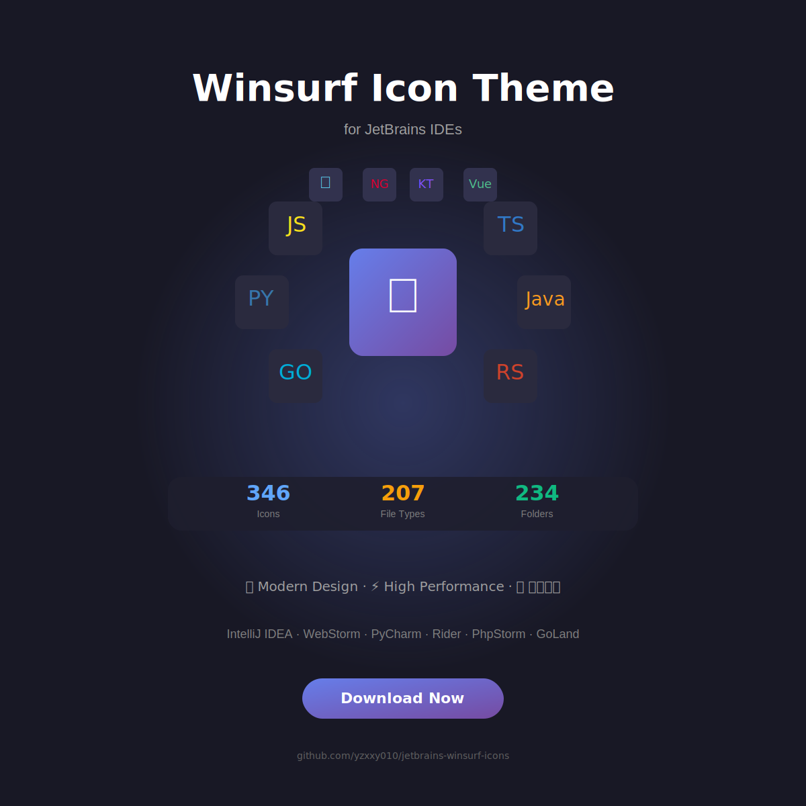

# 🎨 Winsurf Icon Theme for JetBrains IDEs

<div align="center">
  
  
  
  [](https://github.com/yzxxy010/jetbrains-Modern-icons/releases)
  [](https://www.jetbrains.com/)
  [](LICENSE)
  [](showcase.html)
  
  
</div>

---

## 中文

一个为JetBrains全系列IDE精心打造的图标主题插件，包含346个精美图标，让你的开发环境焕然一新。

### ✨ 核心特性

| 特性 | 描述 |
|------|------|
| 🎯 **346个精美图标** | 完整覆盖所有常见文件类型和文件夹 |
| 📁 **智能文件夹识别** | 234种文件夹名称自动匹配对应图标 |
| 📄 **广泛文件支持** | 支持207种文件扩展名 |
| 🎨 **现代设计风格** | 色彩丰富，视觉清晰，16x16标准尺寸 |
| ⚡ **高性能优化** | 智能缓存机制，不影响IDE性能 |
| 🔧 **灵活配置** | 提供设置界面，可按需调整 |

### 📚 支持的技术栈

<details>
<summary>点击展开完整列表</summary>

#### 编程语言（40+种）
- **主流语言**：Java, Kotlin, Python, JavaScript, TypeScript, Go, Rust
- **系统语言**：C, C++, C#, Objective-C, Swift
- **脚本语言**：Ruby, PHP, Perl, Lua, Shell, PowerShell
- **函数式**：Haskell, Scala, Clojure, Erlang, Elixir, F#
- **新兴语言**：Zig, V, Nim, Crystal, Gleam

#### Web技术
- **框架**：React, Vue, Angular, Svelte, Astro, Next.js, Nuxt.js
- **样式**：CSS, SCSS, Less, Stylus, PostCSS, Tailwind
- **模板**：HTML, Pug, EJS, Handlebars, Liquid

#### 构建工具
- **打包**：Webpack, Vite, Rollup, Parcel, ESBuild
- **任务**：Gradle, Maven, Make, CMake, Bazel
- **容器**：Docker, Kubernetes, Docker Compose

#### 数据库
- SQL, MongoDB, PostgreSQL, MySQL, SQLite
- Prisma, Drizzle, TypeORM

#### 云服务
- Firebase, Supabase, Vercel, Netlify, AWS, Azure

</details>

### 🚀 安装方法

#### 方法一：从发布版本安装（推荐）

1. 下载最新版本的 `Modern-icon-theme-1.0.0.zip`
2. 打开你的JetBrains IDE（IDEA、WebStorm、PyCharm、Rider等）
3. 进入 **设置** → **插件** → **⚙️齿轮图标** → **从磁盘安装插件...**
4. 选择下载的zip文件
5. 点击 **确定** 并重启IDE

#### 方法二：从源码构建

```bash
# 克隆仓库
git clone https://github.com/yourusername/Modern-icon-theme
cd jetbrains-icon-theme-plugin

# Windows构建
.\gradlew.bat buildPlugin

# macOS/Linux构建
./gradlew buildPlugin

# 插件文件将生成在 build/distributions/ 目录
```

#### 方法三：从JetBrains Marketplace安装（即将发布）

1. 打开IDE → **设置** → **插件** → **Marketplace**
2. 搜索 **"Modern Icon Theme"**
3. 点击 **安装** → 重启IDE

### ⚙️ 配置选项

安装插件后，可在 **设置** → **外观与行为** → **Modern Icons** 中进行自定义：

- ✅ 启用/禁用Modern图标主题
- 📁 显示自定义文件夹图标
- 📄 显示自定义文件图标
- 🔄 为未知文件类型使用默认图标

### 🤝 贡献指南

欢迎贡献代码！如果你想添加新的图标或改进现有功能：

1. Fork 本仓库
2. 创建特性分支 (`git checkout -b feature/AmazingFeature`)
3. 提交更改 (`git commit -m 'Add some AmazingFeature'`)
4. 推送到分支 (`git push origin feature/AmazingFeature`)
5. 提交 Pull Request

### 📝 许可证

本项目采用 MIT 许可证 - 查看 [LICENSE](LICENSE) 文件了解详情

### 🖼️ 图标预览


---

## English

A beautiful icon theme plugin for JetBrains IDEs with 346 carefully designed icons.

### ✨ Features

| Feature | Description |
|---------|-------------|
| 🎯 **346 Beautiful Icons** | Complete coverage of all common file types and folders |
| 📁 **Smart Folder Recognition** | 234 folder names automatically match corresponding icons |
| 📄 **Extensive File Support** | Support for 207 file extensions |
| 🎨 **Modern Design** | Colorful and clear icons, 16x16 standard size |
| ⚡ **High Performance** | Smart caching mechanism, no impact on IDE performance |
| 🔧 **Flexible Configuration** | Settings page for customization |

### 🚀 Installation

#### Method 1: Install from Release (Recommended)

1. Download the latest `Modern-icon-theme-1.0.0.zip`
2. Open your JetBrains IDE
3. Go to **Settings** → **Plugins** → **⚙️** → **Install Plugin from Disk...**
4. Select the downloaded zip file
5. Click **OK** and restart IDE

#### Method 2: Build from Source

```bash
# Clone repository
git clone https://github.com/yourusername/Modern-icon-theme
cd jetbrains-icon-theme-plugin

# Build on Windows
.\gradlew.bat buildPlugin

# Build on macOS/Linux
./gradlew buildPlugin

# Plugin file will be in build/distributions/
```

### ⚙️ Configuration

After installation, customize settings at **Settings** → **Appearance & Behavior** → **Modern Icons**

## 开发


### 环境要求

- JDK 17或更高版本
- IntelliJ IDEA或其他JetBrains IDE
- Gradle 7.6或更高版本

### 项目结构

```
jetbrains-icon-theme-plugin/
├── src/
│   └── main/
│       ├── kotlin/         # Kotlin源代码
│       └── resources/       # 资源文件
│           ├── icons/       # SVG图标文件
│           └── META-INF/    # 插件配置
├── build.gradle.kts        # Gradle构建配置
└── prepare-icons.ps1       # 图标准备脚本
```

### 构建和测试

```bash
# 构建插件
.\gradlew.bat buildPlugin

# 运行IDE进行测试
.\gradlew.bat runIde

# 验证插件
.\gradlew.bat verifyPlugin
```


### 🖼️ 图标预览


> 💡 **提示**：[点击此处打开互动式图标浏览器](showcase.html) - 可搜索、分类查看所有346个图标

## 贡献

欢迎提交Issue和Pull Request！

## 许可证

MIT License

## 致谢

- 图标设计灵感来自Windsurf主题
- 基于JetBrains Platform Plugin SDK开发
